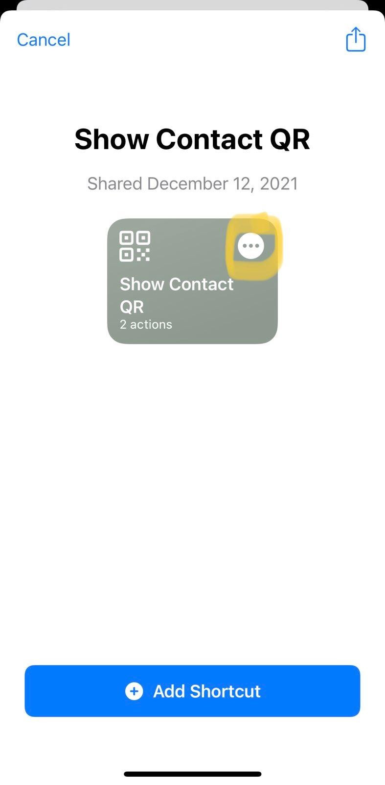

## ContactQR

When I meet new people, I often want to exchange contact info with them. However, it is slow and awkward to trade phones with the person and type in my name and number manually, so I wrote ContactQR, an iOS shortcut that lets me quickly show my contact info encoded as a QR code. When I want to give someone my info, they can simply scan the code.

### Instructions

1. Install the iOS [Shortcuts](https://apps.apple.com/us/app/shortcuts/id915249334) app

2. Install the shortcuts:
	* [Create Contact QR](https://www.icloud.com/shortcuts/343aa0b679994fd1b2a4acf2fd45cb64): To initially set up the QR code.
	* [Show Contact QR](https://www.icloud.com/shortcuts/f6dfb603dc544e6ba28da3dbe961c040): To quickly display the code.

3. In the Shortcuts app, run *Create Contact QR*. Enter the first name, last name, and phone number you want to generate a QR code for (most likely your own name and phone number).

4. Run *Show Contact QR* to display the QR code. I have this shortcut in a widget on my homescreen for easy access.

### Troubleshooting
You may need to enable importing Shortcuts that have not been reviewed by Apple. Go to Settings > Shortcuts, turn on "Allow Untrusted Shortcuts", then try again to install the shortcuts.
Bear in mind that this allows you to install any shortcut, including ones that may be malicious. I promise mine isn't, but you shouldn't trust me or anyone else: you can preview the source code of a shortcut before you install it by tapping the three dots.

### Support or Contact
Need help? Have a suggestion or bug report? [Email me.](mailto:44721499+hspil@users.noreply.github.com)
